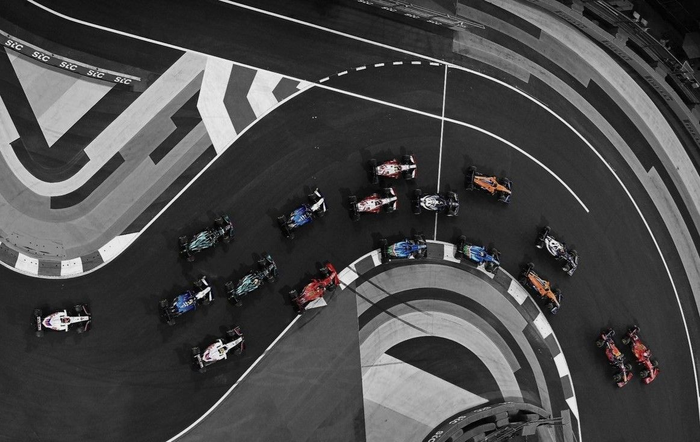

# Exploring the Galaxy
## Overview
This website is a website that visualises the 2026 Formula 1 race calendar as a constellation-style star map. Where each circuit is represented as a constellation. Users can explore the map and click on stars to view information about each circuit.

## Inspiration & Concept
Using the NASA website as a guide that links to the constellation map. I chose to do a map because when I was research using the nada website it was interesting that there were not an option to explore the stars in the sky. So, I used implemented it into my website.

